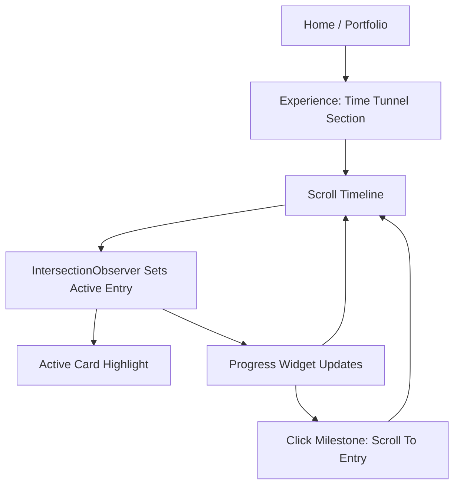

## 1. Product Overview
Rebuild your Experience section into a light-theme “Time Tunnel” timeline.
It should feel scannable and interactive, with scroll-based active highlighting and an in-section progress widget.

## 2. Core Features

### 2.1 Feature Module
1. **Home / Portfolio page (Experience section)**: light-theme “Time Tunnel” timeline, alternating experience cards, active scroll highlighting, in-section progress widget.

### 2.3 Page Details
| Page Name | Module Name | Feature description |
|-----------|-------------|---------------------|
| Home / Portfolio | Experience: Time Tunnel container | Render the Experience section with a clear title, short intro, and a timeline viewport that contains cards + progress widget. |
| Home / Portfolio | Alternating timeline cards | Display experiences as cards alternating left/right around a central “tunnel” spine; include role, company, date range, key bullets, and optional tags/links. |
| Home / Portfolio | Scroll-active highlighting | Use viewport intersection to set an “active” experience; visually emphasize the active card and its matching progress indicator item. |
| Home / Portfolio | In-section progress widget | Show section progress (0–100%) and milestones; reflect active item; allow click/tap to jump/scroll to a selected experience entry. |
| Home / Portfolio | Accessibility & motion preferences | Support keyboard navigation to entries, visible focus states, and reduced-motion behavior (disable heavy transitions if user prefers). |

## 3. Core Process
User Flow (Visitor)
1. You scroll to the Experience section and see the “Time Tunnel” spine with alternating cards.
2. As you scroll within the section, the currently focused/visible card becomes active.
3. The progress widget updates to show how far you are through the Experience section and which milestone is active.
4. You can click a milestone in the progress widget to jump to that experience entry.

