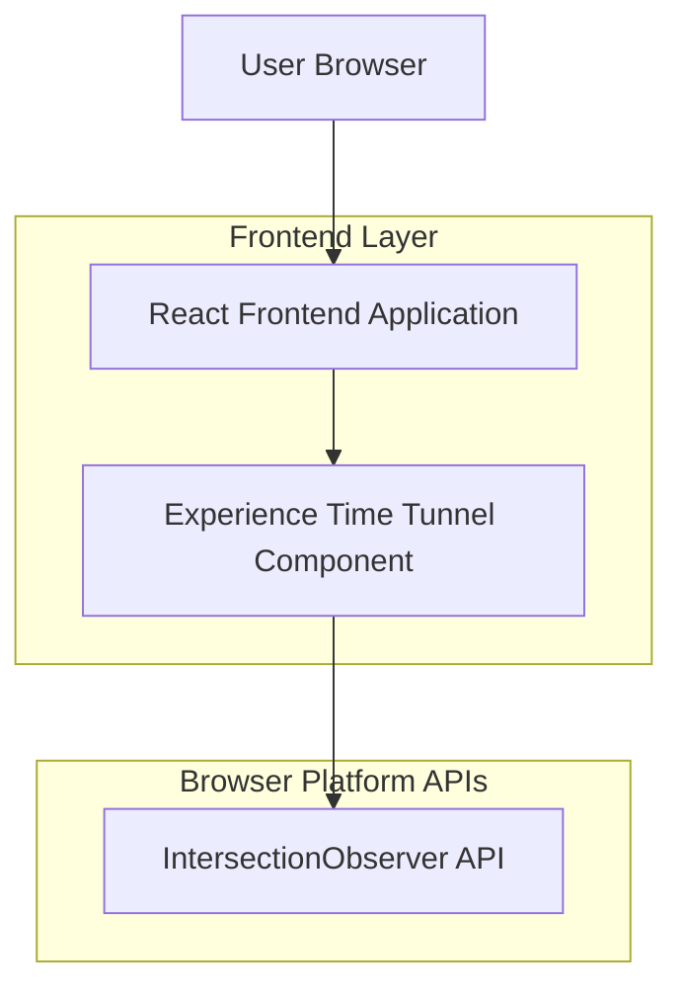

## 1.Architecture design

## 2.Technology Description
- Frontend: React@18 + TypeScript + (existing styling system, e.g., CSS modules or tailwindcss)
- Backend: None

## 3.Route definitions
| Route | Purpose |
|-------|---------|
| / | Home / portfolio page that includes the Experience “Time Tunnel” section |

## 4.API definitions (If it includes backend services)
None

## 6.Data model(if applicable)
None

### Implementation notes (frontend-only)
- Data source: reuse your existing Experience data structure; each entry should have a stable `id` for scroll-to and active tracking.
- Active tracking: one IntersectionObserver observing each timeline entry (or sentinel elements) to set `activeId` based on highest intersection ratio / nearest to center.
- Scroll-to: `element.scrollIntoView({ behavior: prefersReducedMotion ? 'auto' : 'smooth', block: 'center' })`.
- Progress: compute section progress using the Experience section scroll container metrics (or page scroll relative to section bounding rect) and clamp to 0–1.
- Performance: avoid layout thrash by reading DOM metrics in a single rAF tick when needed; keep observers stable across renders.