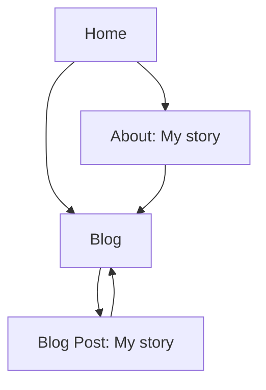

## 1. Product Overview
Add an About page and a minimal Blog to your portfolio site.
This improves personal storytelling (“My story”) and creates a dedicated space for writing (“Blog”).

## 2. Core Features

### 2.2 Feature Module
1. **Home**: navbar entry for Blog, footer-area links/teasers to About (“My story”) and Coding.
2. **About (My story)**: “My story” content section, “Coding” content section placed near the footer, internal links to Blog and Home.
3. **Blog**: list of posts (initially includes “My story”), click-through to post detail.
4. **Blog post (My story)**: readable article layout for `/blog/my-story`.

### 2.3 Page Details
| Page Name | Module Name | Feature description |
|---|---|---|
| Home | Navbar | Add **Blog** item that routes to `/blog`. |
| Home | Footer-area content blocks | Show two compact blocks/cards near footer: **My story** (links to `/about`) and **Coding** (links to `/about#coding` or the Coding section). |
| About (My story) | Page content | Present “My story” narrative content and a “Coding” section near the footer; include clear links back to Home and to Blog. |
| Blog | Post list | Display list of available posts (at minimum: “My story”), each item shows title + short excerpt and links to `/blog/<slug>`. |
| Blog post (My story) | Post detail | Render the “My story” post content with title, date (optional), and back link to `/blog`. |

## 3. Core Process
You can open the site and use the navbar to enter the Blog. From the Blog list you can open “My story” post. From the Home footer-area blocks you can jump to the About page (“My story”) or directly to the Coding section.

