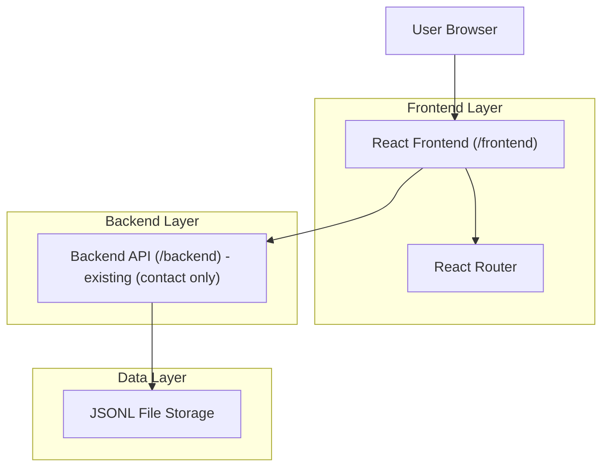

## 1.Architecture design


## 2.Technology Description
- Frontend: React + TypeScript + Vite + React Router (CSS via plain CSS)
- Backend: Python + FastAPI (existing; no new endpoints required for Blog/About)
- Database: None (file-based JSONL for contact submissions only)

## 3.Route definitions
| Route | Purpose |
|---|---|
| / | Home page; add Blog in navbar + footer-area teaser blocks |
| /about | About page (“My story”) with “Coding” section near footer |
| /blog | Blog index page (list posts) |
| /blog/:slug | Blog post page (initially supports `my-story`) |
| /contact | Existing contact page |

## 4.API definitions (If it includes backend services)
No new API required. Blog content is static and rendered in the frontend.

## 6.Data model(if applicable)
Optional (frontend-only): represent posts as a small in-repo collection.
```ts
export type BlogPost = {
  slug: string; // e.g. "my-story"
  title: string;
  excerpt: string;
  content: string; // or markdown string
  publishedAt?: string;
};
```