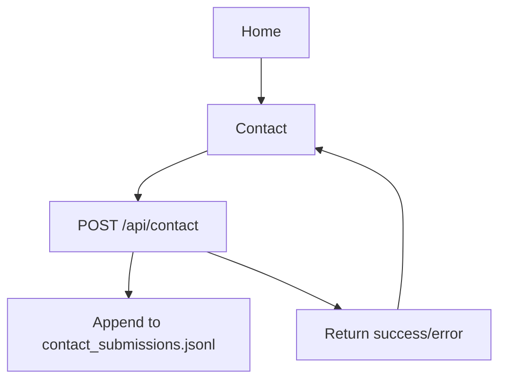

## 1. Product Overview
A portfolio monorepo with a React frontend and a small backend API.
You will showcase your work and provide a “Contact” page with a Dannaway-inspired split layout and a form that stores submissions as JSONL.

## 2. Core Features

### 2.1 Feature Module
1. **Home**: project highlights, navigation to Contact.
2. **Contact**: Dannaway-inspired split layout, contact form, submit status/feedback.

### 2.3 Page Details
| Page Name | Module Name | Feature description |
|---|---|---|
| Home | Header / Navigation | Show your name + primary navigation with a prominent “Contact” CTA. |
| Home | Portfolio Highlights | Present a curated list/grid of featured projects with title, short description, and link(s). |
| Home | Footer | Provide basic external links (e.g., GitHub/LinkedIn) and copyright. |
| Contact | Hero / Split Layout | Render a desktop-first split layout: left panel for short copy + social links; right panel for the form. |
| Contact | Contact Form | Collect name, email, and message; validate required fields; block double-submit while pending. |
| Contact | Submit Feedback | Show success/failure message; keep user input on failure; optionally clear on success. |

## 3. Core Process
**Visitor Flow**
1. You land on Home and browse project highlights.
2. You click “Contact” to open the Contact page.
3. You fill the form and submit.
4. The frontend POSTs the payload to the backend API.
5. The backend validates and appends one JSON line to a JSONL file.
6. You see a success confirmation (or an error message if submission failed).

