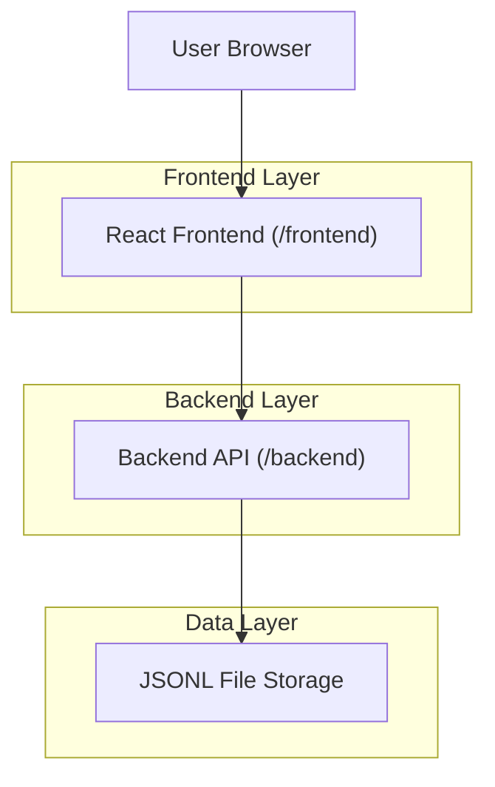
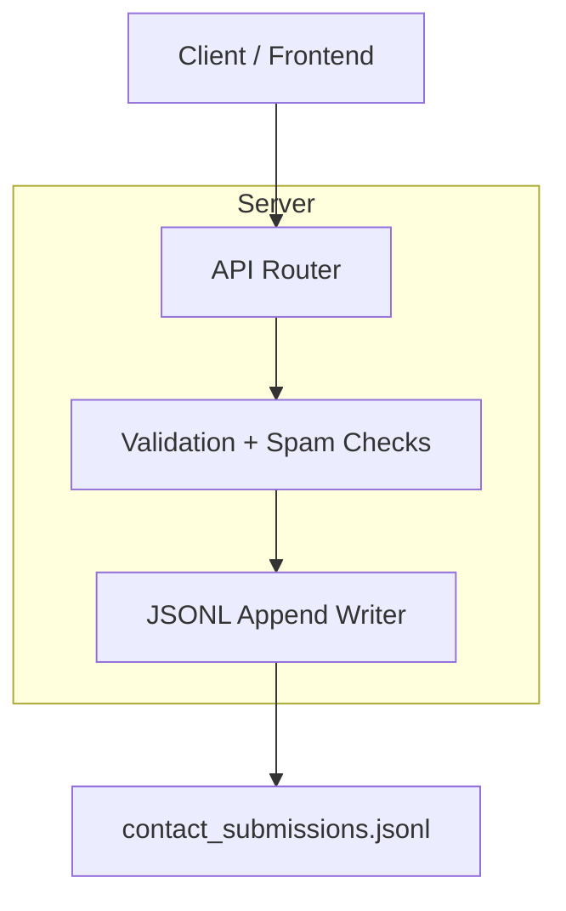

## 1.Architecture design


## 2.Technology Description
- Frontend: React + TypeScript + Vite + React Router (CSS via plain CSS)
- Backend: Python + FastAPI + Pydantic (Uvicorn for dev)
- Database: None (append-only JSONL file on disk)

## 3.Route definitions
| Route | Purpose |
|---|---|
| / | Home page with project highlights and navigation |
| /contact | Dannaway-inspired contact layout + contact form |

## 4.API definitions (If it includes backend services)
### 4.1 Core API
Create contact submission
```
POST /api/contact
```

Request (JSON)
| Param Name | Param Type | isRequired | Description |
|---|---:|---:|---|
| name | string | true | Sender name |
| email | string | true | Sender email (validated) |
| message | string | true | Message body |

Response
| Param Name | Param Type | Description |
|---|---:|---|
| ok | boolean | Success status |
| error | string | Error message when ok=false |

Shared types (TypeScript)
```ts
export type ContactRequest = {
  name: string;
  email: string;
  message: string;
};

export type ContactResponse =
  | { ok: true; id: string }
  | { ok: false; error: string };
```

## 5.Server architecture diagram (If it includes backend services)


## 6.Data model(if applicable)
### 6.1 Data model definition
Each submission is stored as one JSON object per line (JSONL), e.g.:
```json
{"id":"<uuid>","ts":"2026-02-08T12:34:56.000Z","name":"","email":"","message":""}
```

### 6.2 Data Definition Language
Not applicable (file-based append-only storage).
