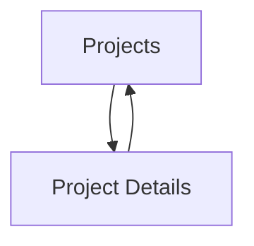

## 1. Product Overview
A clean, monochrome Projects experience that lists your projects and lets visitors open a dedicated detail page per project.
All project content is sourced from `backend/app/data/profile.json` to keep updates simple and consistent.

## 2. Core Features

### 2.1 User Roles
No role distinction is required (public read-only portfolio pages).

### 2.2 Feature Module
Our Projects requirements consist of the following main pages:
1. **Projects**: project list, project cards, navigation to project detail.
2. **Project Details**: project overview, impact bullets, tags, external links.

### 2.3 Page Details
| Page Name | Module Name | Feature description |
|-----------|-------------|------------------|
| Projects | Data loading | Fetch projects list from `GET /api/projects` backed by `profile.json`. |
| Projects | Project list | Display projects as a scannable list/grid of cards showing name, year, tags, and a short impact preview. |
| Projects | Navigation to detail | Open a project detail page via a stable URL `/projects/:slug` for each project. |
| Projects | Empty/error states | Show loading skeleton; show “No projects found” if none; show a retry-friendly error state if API fails. |
| Project Details | Data loading | Fetch a single project from `GET /api/projects/{slug}` backed by `profile.json`. |
| Project Details | Project header | Show project name, year, and key tags; include external links when provided (demo/github). |
| Project Details | Impact section | Render full impact bullets (as provided in `profile.json`). |
| Project Details | Back navigation | Provide a clear way to return to Projects list (breadcrumb/back link). |
| Project Details | Not-found state | Show a 404-style state when slug does not match any project. |

## 3. Core Process
Visitor Flow:
1. You open **Projects** and the page loads project entries from the backend.
2. You browse projects and click one item.
3. You land on **Project Details** (`/projects/:slug`), where the page loads the matching project by slug.
4. You optionally open external links (demo/github) if present, then return to **Projects**.

