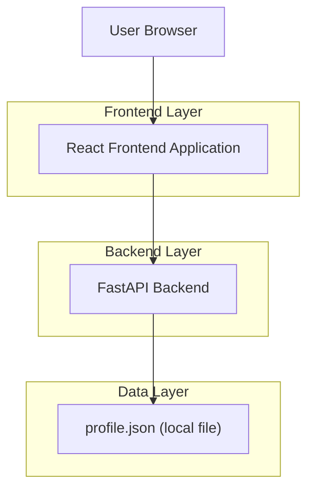
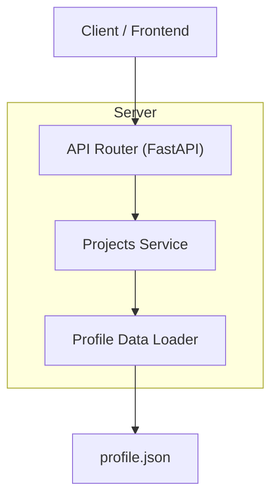

## 1.Architecture design


## 2.Technology Description
- Frontend: React@18 + TypeScript + vite + react-router
- Backend: FastAPI (Python)
- Database: None (reads from `backend/app/data/profile.json`)

## 3.Route definitions
| Route | Purpose |
|-------|---------|
| /projects | Projects list page (cards/grid) |
| /projects/:slug | Project details page for a single project |

## 4.API definitions (If it includes backend services)
### 4.1 Core Types (shared contract)
```ts
export type ProjectLink = {
  demo: string;   // may be empty string
  github: string; // may be empty string
};

export type Project = {
  name: string;
  year: string;
  tags: string[];
  impact: string[];
  links: ProjectLink;
  slug: string; // derived for routing (kebab-case from name)
};

export type ProjectsListResponse = {
  projects: Project[];
};

export type ProjectResponse = {
  project: Project;
};
```

### 4.2 Endpoints
#### List projects
```
GET /api/projects
```
Response:
| Field | Type | Description |
|------|------|-------------|
| projects | Project[] | All projects from `profile.json` with a computed `slug` |

#### Get project by slug
```
GET /api/projects/{slug}
```
Response (200):
| Field | Type | Description |
|------|------|-------------|
| project | Project | Matching project |

Response (404):
| Field | Type | Description |
|------|------|-------------|
| detail | string | Not found message |

### 4.3 Slug rules (to keep URLs stable)
- Compute `slug` from `project.name` using: lowercase → trim → replace `&` with `and` → replace any non-alphanumeric runs with `-` → collapse repeated `-` → trim `-`.
- Uniqueness: if two projects collide, append `-2`, `-3`, etc. in the list order from `profile.json`.

## 5.Server architecture diagram (If it includes backend services)


## 6.Data model(if applicable)
No database data model is required because the source of truth is the JSON file `backend/app/data/profile.json`.
