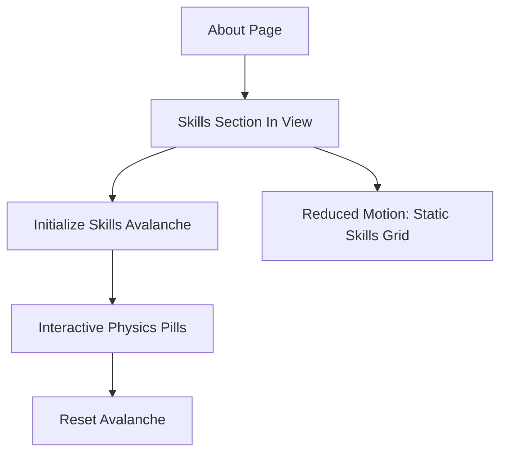

## 1. Product Overview
Replace the static skills list on your About page with an interactive “Skills Avalanche” playground: physics-based skill pills that tumble, collide, and can be dragged.
It initializes only when the section scrolls into view and visually matches your existing site theme.

## 2. Core Features

### 2.2 Feature Module
Our requirements consist of the following main pages:
1. **About page**: Skills Avalanche section, interactions, theming consistency, accessibility and performance safeguards.

### 2.3 Page Details
| Page Name | Module Name | Feature description |
|-----------|-------------|---------------------|
| About page | Skills Avalanche container | Render a bounded playground area that replaces the current skills list while preserving section heading/context copy. |
| About page | Skills data source | Use the existing skills list content as the single source of truth to generate pill labels (no duplicate editing). |
| About page | On-scroll initialization | Detect when the section enters viewport and lazily initialize the physics simulation; avoid re-initializing on small scroll changes. |
| About page | Physics pill simulation | Spawn pill “chips” with collisions, gravity, and boundary walls; settle into a stable resting state. |
| About page | User interactions | Allow drag-and-throw pills; allow tap/click to “nudge” nearby pills; provide a “Reset” control to respawn/re-stack. |
| About page | Theme matching | Match pill colors, borders, shadows, typography, and background to current theme tokens; support dark/light if your site has it. |
| About page | Motion & accessibility | Respect reduced-motion preference by switching to a non-physics static pill grid; ensure keyboard focus and readable contrast. |
| About page | Performance safeguards | Pause simulation when off-screen or tab hidden; cap object count and tick rate to keep smooth scrolling. |

## 3. Core Process
User flow:
1. You scroll down the About page.
2. When the Skills section is near/inside the viewport, the “Skills Avalanche” initializes and pills drop into the container.
3. You drag pills around, toss them, or click/tap to nudge.
4. You can press “Reset” to replay the avalanche.
5. If you prefer reduced motion, you see a static skills layout instead.

