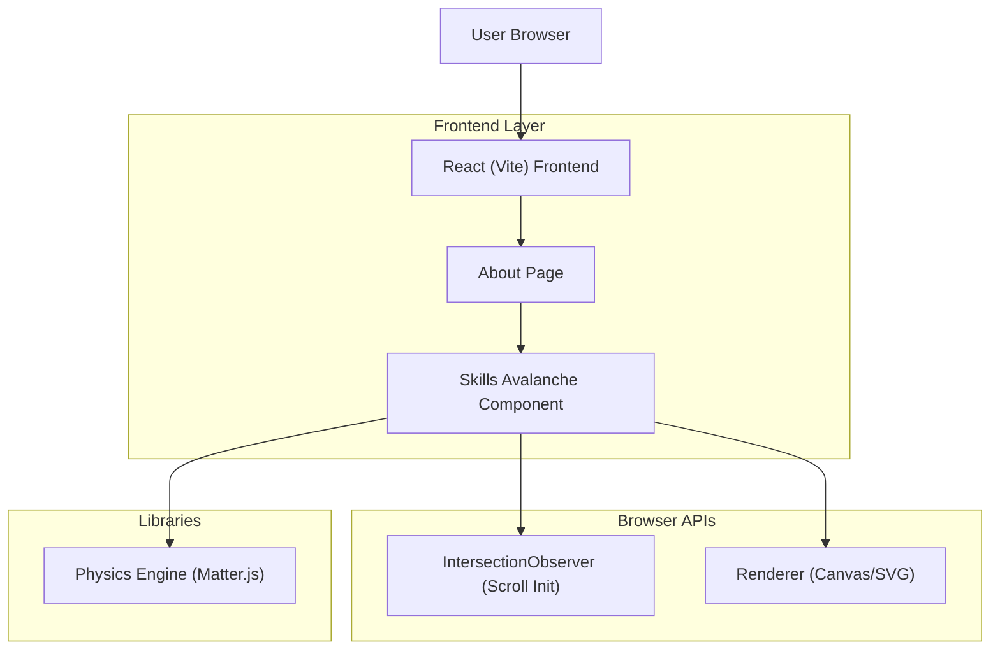

## 1.Architecture design

## 2.Technology Description
- Frontend: React@18 + TypeScript + vite + tailwindcss@3
- Physics: matter-js (2D rigid-body physics)
- Backend: None

## 3.Route definitions
| Route | Purpose |
|-------|---------|
| /about | About page; contains the Skills section with the Skills Avalanche playground |

## 6.Data model(if applicable)
No persistent data model required (skills text is sourced from existing About content).

Notes / key implementation constraints:
- Initialize simulation only once per page view when the Skills section is in view (IntersectionObserver with a sensible threshold).
- Respect `prefers-reduced-motion`: disable physics and render a static pills layout.
- Pause/stop the engine when the section is off-screen or tab is hidden to reduce CPU usage.
- Theme matching must consume existing design tokens (colors, radii, shadows, typography) and the current theme state (light/dark if present).
